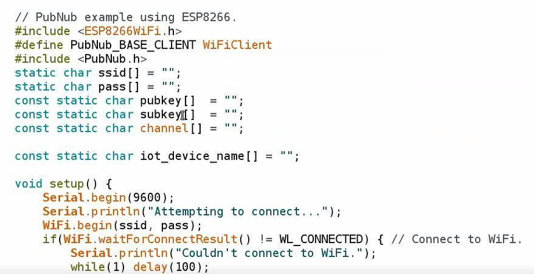
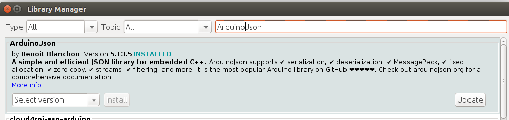
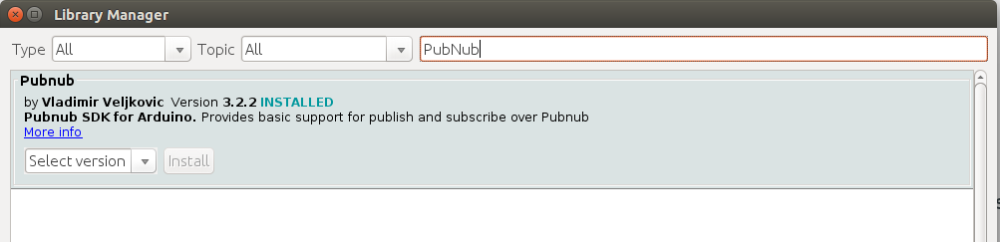
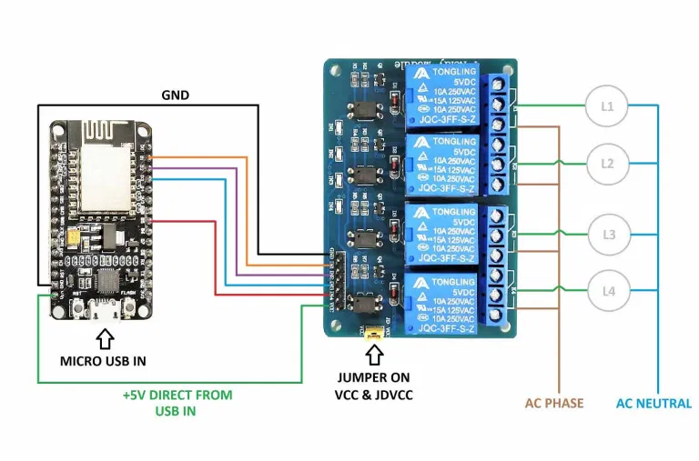

# COGU
COGU (Command guard), it's a utility software designed to simplify the life, by automating and enabling the things to be controlled by commands and buttons over the internet from any part of the globe.
<p> This repo contains all the nessary files and folders required to setup cogu on the go. All you need is to follow the instructions and you are ready to go! </p>

### About
In present world, the need of the hour is to get the control and how easy it is to do your work done. The growing laziness and curiosity in humans leads to make the tasks to be automated this leads to the cause of many new inventions. Amid this Covid-19 pandemic, people were ultimately forced to work from home, now since the Unlock phase is started and the peoples are coming out of their home all they need is to make their lifes easier and simpler than before. This software or tool will help them to do so by control their desktop and home from any location. It is said that "Necessity is the mother of invention". Here, COGUsrole comes into the play, this enables many features through the inhand app and desktop client, moreover it also provides the control of appliences with IoT. So all you need is to setup this software for your app, and can control the things with commands and internet.

> The app and site is under development more features will shortly be available in the future which enables the support to windows and more features with just the touch of a button.

<br>
## Use cases
- You are working on a secret project and your PC contains sensitive information. You leave your home/office in a hurry and are worried whether you locked your PC or not. This is where our App comes in. Using COGU you can remotely lock your PC, preventing it from prying eyes.

- You are far away from your PC, but want to give someone access to it, without revealing your login details. You can remotely unlock your PC, and also monitor the user’s actions on the PC using our App.

- It is not rare that we move out of our rooms without switching off the appliances. COGU helps you to remotely switch on/off your electrical appliances and helps both your pockets and our environment by preserving electricity.

- Using our App you can save your valuable time. Imagine this, you are minutes away from your home. You can remotely switch on your PC and all the electrical appliances of your room, so that when you reach home you can directly start working on what’s important rather than waiting for your PC to boot up.


## How to set up:-
This software comes with three platform support:
  - App
  - Iot (NodeMcU)
  - Desktop client

So follow the individually for each of the side to set it up completely.

### Pubnub Platform Configuration
The primary step is to obtain pubnub's publisher subscriber key from their site. As we are using their platforms and APIs for this project. To do so folow the instructions:-

- Go to pubnub's official [site](https://dashboard.pubnub.com/login) for signup or login. Create one if you do now have or just sign in using your google id.

- Go to KEYS section and copy your publisher and subscriber keys from the demo keyset.

> These API keys are very sensitive please don't expose your keys in public make it private to you only otherwise someone can hack to your system.

### Desktop client
>***Run each and every command without sudo and give the sudo password only when it asks or prompts.***

- Clone the Repository and go to the folder by :-
  ```bash
  $ git clone https://github.com/abhyamgupta123/COGU_.git
  $ cd COGU_
  ```
- Modify the `keys_data.txt` files as :-
  - pubnub_pub_key = \<place your pubnub publisher key\>
  - pubnub_sub_key = \<place your pubnub subscriber key\>
  - pubnub_channel = \<name your channel over which communication will happen\>
  - pubnub_device_name = \<name your computer to be uniquly identified over channel\>

> Channel name is just a name you give to a channel so that through which communication will happen, you can give any name but make sure to register the same name in all corresponding channels devices.

>A channel can have only one desktop slient in it and as many as Iot cliets, but you can also create as many channels as you want each for your desktop clients.

- Now, make the `setup_cogu.sh` file executable and run it:-
  ```bash
  $ chmod +x setup_cogu.sh
  $ bash setup_cogu.sh
  ```

> ***Make sure again `DO NOT` run the script with sudo as it will not work properly. Only provide sudo password when it prompts.***

Now you are ready with your Desktop client.
You can check the log files if in case of any issue , present at `/var/local/cogu.log` and `/var/local/cogu_logging.log`.

### Configuring App

Now you can just open the `COGU` folder with your android studio and just run it to for your specific mobile device. or you can download the apk file from the [link]().

> The link is not working currently it will be available soon. For now you have to run the project in android studio only. **Sorry for inconvenience**.

### Configuring IoT
- Open the nodemcu.ino file in `Arduino_iot/nodemcu` folder through Arduino IDE.
- Fill the following required fields(Required) with the same values as you used to configure Desktop client.
  1. ssid of wifi
  2. password of wifi
  3. pubkey
  4. subkey
  5. channel name
  6. iot_device_name.

  

- Setup the Arduino IDE by `File -> Preferences`, and add the following url to ​`Additional Board Manager URLs` ​ section.
and click ok.
 - >http://arduino.esp8266.com/stable/package_esp8266com_index.json

- Now add the NodeMCU board to Arduino IDE by navigating `Tools -> Boards -> Board Manager`. Search for `esp8266` and install the board.

- After installing the board Select the board and Port to upload the Sketch by `Tools -> Port and Tools -> Board` and select the board as ​ `NodeMCU 1.0 (ESP-12EModule)`

- Go to `sketch ​-> include library ​->​ manage library` and download the following libraries:
  - ​PubNub Library (3.2.2)
  - ​ArduinoJson (5.13.5)

  Once this is done. The Installed tab should look something like this.
  
  

<br>

>Be very specific in downloading the exact versions mentioned above.

<br>

Now you are Done.
To upload the Sketch, Do the necessary changes in code if you want, as
described in the code instruction, but don’t do any edit which you don’t
understand as it may affect the working of device.
<br><br>
>***Currently the code is configured to use with Relay Modules, and that
require ​ High Voltage Pulse ​ to turn off and ​ Low voltage Pulse ​ ​ to turn on,
So if you connect any other device it may behave in reverse order of
switching on and off.***


*The sample Circuit Diagram is given Below for reference:-*



<br>
>*It’s strongly recommended to power the relay module with an external
power supply rather than providing all power from NodeMCU as it’s
current rating is very low and usually operate on 3.3V while the relay
demands 5V, It may lead to fluctuation of light thereby damaging the
appliance or module.*
